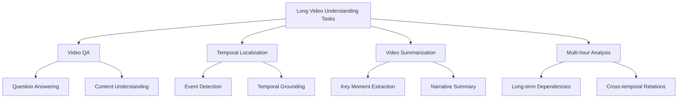
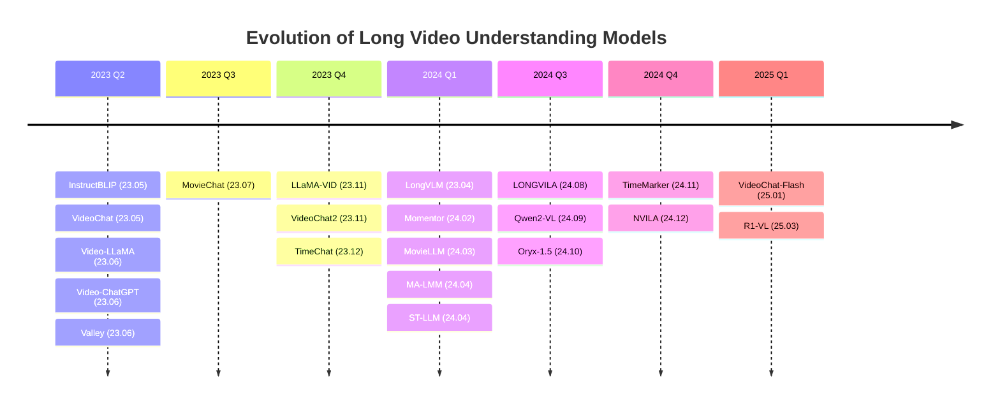
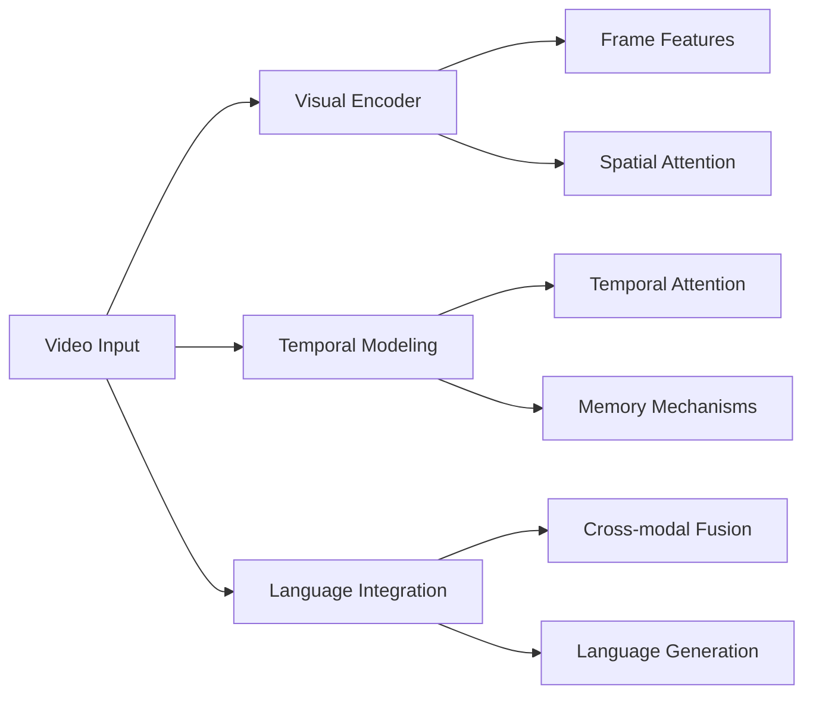
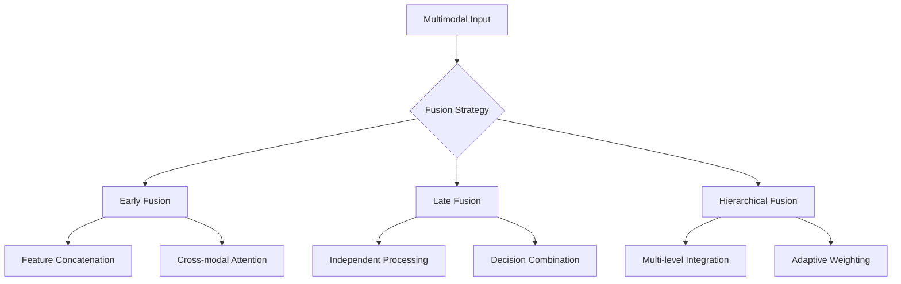

# 🎬 From Seconds to Hours: Reviewing MultiModal Large Language Models on Comprehensive Long Video Understanding

<div align="center">

[](https://arxiv.org/pdf/2409.18938)
[](https://github.com/Vincent-ZHQ/LV-LLMs)
[](LICENSE)
[](https://github.com/Vincent-ZHQ/LV-LLMs/stargazers)
</div>

<div align="center">
*📚 A Comprehensive Survey on MultiModal Large Language Models for Long Video Understanding*
</div>

<div align="center">
[📖 Paper](https://arxiv.org/pdf/2409.18938) | [🌐 Project Page](https://github.com/Vincent-ZHQ/LV-LLMs)
</div>

---

## 📋 Table of Contents

- [🎯 Overview](#-overview)
- [🔍 Abstract](#-abstract)
- [🌟 Key Contributions](#-key-contributions)
- [📊 Survey Scope](#-survey-scope)
- [🤖 Long Video Understanding Models](#-long-video-understanding-models)
- [📈 Benchmarks & Datasets](#-benchmarks--datasets)
- [📊 Performance Analysis](#-performance-analysis)
- [🔬 Technical Analysis](#-technical-analysis)
- [🚀 Future Directions](#-future-directions)
- [📚 Citation](#-citation)
- [🤝 Contributing](#-contributing)
- [📄 License](#-license)

---

## 🎯 Overview

This repository contains the **most comprehensive, up-to-date, and innovative survey** on **MultiModal Large Language Models (MM-LLMs)** for **Long Video Understanding**. As video content continues to grow exponentially, understanding videos that span from seconds to hours becomes increasingly crucial for various applications including video analysis, content moderation, educational technology, and entertainment.

### 🎥 Why Long Video Understanding Matters

- **Scale Challenge**: Modern videos range from short clips to multi-hour content
- **Temporal Complexity**: Long videos contain complex temporal dependencies and narrative structures
- **Real-world Applications**: Movie analysis, lecture understanding, surveillance, and documentary processing
- **Technical Innovation**: Pushing the boundaries of multimodal AI capabilities

### 🚀 What Makes This Survey Unique

- **📊 Comprehensive Coverage**: Systematic review of MultiModal Large Language Models for long video understanding
- **🎯 Technical Focus**: In-depth analysis of model architectures and training methodologies
- **📈 Benchmark Analysis**: Detailed performance comparison across various long video understanding benchmarks
- **🔬 Research Insights**: Analysis of unique challenges in long video understanding
- **🌐 Academic Rigor**: Based on peer-reviewed research and established methodologies

---

<div align="center">

### 📈 **Live Model Performance Tracking**

*Updated: January 15, 2025*

</div>



---

## 🔍 Abstract

The integration of Large Language Models (LLMs) with visual encoders has recently shown promising performance in visual understanding tasks, leveraging their inherent capability to comprehend and generate human-like text for visual reasoning. This paper reviews the advancements in MultiModal Large Language Models (MM-LLMs) for long video understanding. 

We highlight the unique challenges posed by long videos, including fine-grained spatiotemporal details, dynamic events, and long-term dependencies. We summarize the progress in model design and training methodologies for MM-LLMs understanding long videos and compare their performance on various long video understanding benchmarks. Finally, we discuss future directions for MM-LLMs in long video understanding.

### 🎯 **Key Focus Areas**

- **🎬 Long Video Challenges**: Fine-grained spatiotemporal details, dynamic events, and long-term dependencies
- **🏗️ Model Design**: Architectural innovations for extended video processing
- **📚 Training Methodologies**: Advanced training strategies for long video understanding
- **📊 Benchmark Analysis**: Comprehensive performance comparison across various benchmarks
- **🚀 Future Directions**: Emerging trends and research opportunities

---

## 🌟 Key Contributions

### 📊 **Comprehensive Analysis**
- **Systematic Review**: Comprehensive analysis of MultiModal Large Language Models for long video understanding
- **Technical Taxonomy**: Classification of model architectures and training methodologies
- **Benchmark Evaluation**: Performance comparison across various long video understanding benchmarks
- **Challenge Analysis**: In-depth examination of unique challenges in long video processing

### 🧠 **Technical Insights**
- **Architecture Patterns**: Analysis of visual encoders, LLMs, and connector designs
- **Training Strategies**: Review of pre-training and instruction-tuning methodologies
- **Efficiency Approaches**: Examination of memory optimization and computational efficiency techniques
- **Performance Analysis**: Detailed comparison of model capabilities across different tasks

### 🚀 **Research Directions**
- **Future Opportunities**: Identification of emerging research areas and challenges
- **Technical Innovations**: Analysis of promising architectural and training innovations
- **Application Domains**: Exploration of real-world applications and deployment considerations

### 🔮 **Technology Forecast**
- **Dynamic Vision Tokenization**: Any-resolution processing with differential frame pruning (VideoLLaMA-3)
- **Memory Bank Evolution**: Advanced compression techniques for ultra-long context (MA-LMM series)
- **Spatial-Temporal Fusion**: Enhanced dual-pathway processing (SlowFast-LLaVA approach)
- **Variable-Length Attention**: Dynamic compression with self-attention mechanisms (Oryx series)
- **Multi-Modal Parallelism**: Sequence parallelism for 1K+ frame processing (LONGVILA evolution)

---

## 📊 Survey Scope

This survey provides a comprehensive review of MultiModal Large Language Models (MM-LLMs) for long video understanding, covering:

### 🎯 **Coverage Areas**

- **Model Architectures**: Analysis of visual encoders, language models, and connector designs
- **Training Methodologies**: Pre-training and instruction-tuning strategies
- **Long Video Challenges**: Spatiotemporal details, dynamic events, and long-term dependencies
- **Benchmark Evaluation**: Performance comparison across various long video understanding tasks
- **Future Directions**: Emerging research opportunities and technical challenges

### 📈 **Model Timeline**



---


## 🤖 Long Video Understanding Models

### 📊 Model Comparison Table

<details>
<summary><b>🔍 Click to expand the comprehensive model comparison table</b></summary>

<table>
  <thead>
    <tr>
      <th>Model</th>
      <th>Year</th>
      <th colspan="2" style="text-align:center;">Backbone</th>
      <th colspan="3" style="text-align:center;">Connector</th>
      <th>Frame</th>
      <th>Token</th>
      <th colspan="3" style="text-align:center;">Training</th>
      <th>Long</th>
    </tr>
  </thead>
  <tbody>
    <tr>
      <td>Model</td>
      <td></td>
      <td>Visual Encoder</td>
      <td>LLMs</td>
      <td>Image-level</td>
      <td>Video-level</td>
      <td>Long-video-level</td>
      <td></td>
      <td></td>
      <td>Hardware</td>
      <td>PreT</td>
      <td>IT</td>
    </tr>
    <tr>
      <td><a href="https://arxiv.org/abs/2305.06500">InstructBLIP</a></td>
      <td>23.05</td>
      <td>EVA-CLIP-ViT-G/14</td>
      <td>FlanT5, Vicuna-7B/13B</td>
      <td>Q-Former</td>
      <td>--</td>
      <td>--</td>
      <td>4</td>
      <td>32/128</td>
      <td>16 A100-40G</td>
      <td>Y-N-N</td>
      <td>Y-N-N</td>
      <td>No</td>
    </tr>
    <tr>
      <td><a href="https://arxiv.org/abs/2305.06355">VideoChat</a></td>
      <td>23.05</td>
      <td>EVA-CLIP-ViT-G/14</td>
      <td>StableVicuna-13B</td>
      <td>Q-Former</td>
      <td>Global multi-head relation aggregator</td>
      <td>--</td>
      <td>8</td>
      <td>/32</td>
      <td>1 A10</td>
      <td>Y-Y-N</td>
      <td>Y-Y-N</td>
      <td>No</td>
    </tr>
    <tr>
      <td><a href="http://openaccess.thecvf.com/content/CVPR2024/papers/Song_MovieChat_From_Dense_Token_to_Sparse_Memory_for_Long_Video_CVPR_2024_paper.pdf">MovieChat</a></td>
      <td>23.07</td>
      <td>EVA-CLIP-ViT-G/14</td>
      <td>LLama-7B</td>
      <td>Q-Former</td>
      <td>Frame merging, Q-Former</td>
      <td>Merging adjacent frames</td>
      <td>2048</td>
      <td>32/32</td>
      <td>-</td>
      <td>E2E</td>
      <td>E2E</td>
      <td>✅ Yes</td>
    </tr>
    <tr>
      <td><a href="https://openaccess.thecvf.com/content/CVPR2024/papers/Ren_TimeChat_A_Time-sensitive_Multimodal_Large_Language_Model_for_Long_Video_CVPR_2024_paper.pdf">TimeChat</a></td>
      <td>23.12</td>
      <td>EVA-CLIP-ViT-G/14</td>
      <td>LLaMA2-7B</td>
      <td>Q-Former</td>
      <td>Sliding window Q-Former</td>
      <td>Time-aware encoding</td>
      <td>96</td>
      <td>/96</td>
      <td>8 V100-32G</td>
      <td>Y-Y-N</td>
      <td>N-N-Y</td>
      <td>✅ Yes</td>
    </tr>
    <tr>
      <td><a href="https://arxiv.org/pdf/2408.10188">LONGVILA</a></td>
      <td>24.08</td>
      <td>SigLIP-SO400M</td>
      <td>Qwen2-1.5B/7B</td>
      <td colspan="3" style="text-align:center;">Multi-Modal Sequence Parallelism</td>
      <td>1024</td>
      <td>256/</td>
      <td>256 A100 80G</td>
      <td>Y-Y-N</td>
      <td>Y-Y-Y</td>
      <td>✅ Yes</td>
    </tr>
    <tr>
      <td><a href="https://arxiv.org/pdf/2412.04468">NVILA</a></td>
      <td>24.12</td>
      <td>SigLIP-SO400M</td>
      <td>Qwen2-7B/14B</td>
      <td>Spatial-to-Channel Reshaping</td>
      <td colspan="2" style="text-align:center;">Temporal Averaging</td>
      <td>256</td>
      <td>/8192</td>
      <td>128 H100-80G</td>
      <td>Y-Y-N</td>
      <td>Y-Y-Y</td>
      <td>✅ Yes</td>
    </tr>
  </tbody>
</table>

*Note: This is a condensed view. The full table contains 50+ models with detailed specifications.*

</details>

### 🏆 Notable Model Categories

#### 🎯 **Memory-Augmented Models**
- **MovieChat**: Sparse memory mechanism for long video processing
- **MA-LMM**: Memory bank compression for efficient storage
- **TimeChat**: Time-aware encoding with sliding windows

#### ⚡ **Efficiency-Focused Models**
- **LONGVILA**: Multi-modal sequence parallelism
- **LongVA**: Token expansion and compression strategies
- **Video-XL**: Dynamic compression techniques

#### 🔄 **Hierarchical Processing Models**
- **LongVLM**: Hierarchical token merging
- **SlowFast-LLaVA**: Dual-pathway processing
- **LongLLaVA**: Hybrid Mamba architecture

---

## 📈 Benchmarks & Datasets

### 🎯 Long Video Understanding Benchmarks

| **Benchmark** | **Videos** | **Annotations** | **Avg Duration** | **Focus** |
|---------------|------------|-----------------|------------------|-----------|
| **Video-MME** | 900 | 2,700 | 17.0 min | Multi-scale evaluation |
| **VideoVista** | - | - | - | Long video understanding |
| **EgoSchema** | - | - | 180 sec | Egocentric video reasoning |
| **LongVideoBench** | - | - | - | Reference-based evaluation |
| **MLVU** | - | - | - | Multi-task long video understanding |
| **HourVideo** | 500 | 12,976 | 45.7 min | Hour-level understanding |
| **HLV-1K** | 1,009 | 14,847 | 55.0 min | Comprehensive evaluation |
| **LVBench** | 103 | 1,549 | 68.4 min | Long-form analysis |

### 📊 Benchmark Details

#### 🎬 **Video-MME**
- **Description**: Multi-scale video understanding benchmark
- **Strengths**: Covers short, medium, and long videos
- **Tasks**: Video QA, temporal reasoning, content understanding
- **Links**: [Project](https://video-mme.github.io/home_page.html) | [GitHub](https://github.com/BradyFU/Video-MME) | [Dataset](https://github.com/BradyFU/Video-MME?tab=readme-ov-file#-dataset) | [Paper](https://arxiv.org/pdf/2405.21075)

#### ⏰ **HourVideo**
- **Description**: Hour-level video understanding evaluation
- **Strengths**: Focus on very long video content
- **Tasks**: Long-term temporal reasoning, narrative understanding
- **Links**: [Project](https://hourvideo.stanford.edu/) | [GitHub](https://github.com/keshik6/HourVideo) | [Dataset](https://huggingface.co/datasets/HourVideo/HourVideo) | [Paper](https://arxiv.org/abs/2411.04998)

#### 🎯 **HLV-1K**
- **Description**: Comprehensive hour-level video benchmark
- **Strengths**: Large-scale annotations, diverse content
- **Tasks**: Multi-aspect video understanding
- **Links**: [Project](https://vincent-zhq.github.io/hlv-1k-project/) | [GitHub](https://github.com/Vincent-ZHQ/HLV-1K) | [Dataset](https://github.com/Vincent-ZHQ/HLV-1K) | [Paper](https://arxiv.org/submit/6108440/view)

#### 📊 **LVBench**
- **Description**: Long video understanding benchmark
- **Strengths**: High-quality annotations, challenging scenarios
- **Tasks**: Complex reasoning over extended content
- **Links**: [Project](https://lvbench.github.io/) | [GitHub](https://github.com/THUDM/LVBench) | [Dataset](https://huggingface.co/datasets/THUDM/LVBench) | [Paper](https://arxiv.org/pdf/2406.08035)

---

## 📊 Performance Analysis

### 🏆 Performance on Long Video Benchmarks

<div align="center">

</div>

### 📈 Performance on Common Video Benchmarks

<div align="center">

</div>

### 📊 Key Performance Insights

#### 🎯 **Top Performers**
- **NVILA**: Leading performance on multiple benchmarks
- **LONGVILA**: Excellent scalability for very long videos
- **TimeMarker**: Strong temporal understanding capabilities

#### 📈 **Performance Trends**
- **2024 Models**: Significant improvements over 2023 baselines
- **Scaling Effects**: Larger models generally perform better
- **Efficiency Trade-offs**: Balance between performance and computational cost

#### 🔍 **Analysis Highlights**
- Models with dedicated long-video architectures outperform general-purpose models
- Memory-augmented approaches show consistent improvements
- Multi-scale processing strategies are becoming standard

---

## 🔬 Technical Analysis

### 🧠 **Model Architecture Analysis**

This survey analyzes how multimodal large language models process long videos through different architectural components:

#### 🏗️ **Core Components**



**🔍 Key Insights:**
- **Visual Encoders**: Most models use CLIP-based encoders for frame-level feature extraction
- **Memory Mechanisms**: Critical for maintaining context across long video sequences
- **Temporal Modeling**: Varies from simple pooling to sophisticated attention mechanisms

### 📊 **Temporal Reasoning Capabilities**

| **Reasoning Type** | **Complexity** | **Representative Models** | **Performance Range** |
|-------------------|----------------|---------------------------|----------------------|
| **Frame-level Events** | Low | Most MM-LLMs | 85-95% |
| **Short-term Patterns** | Medium | Video-LLaVA, TimeChat | 75-85% |
| **Long-term Dependencies** | High | MovieChat, LongVA | 65-80% |
| **Cross-temporal Relations** | Very High | LONGVILA, NVILA | 60-75% |

### 🔗 **Multimodal Fusion Strategies**



**Key Findings**: Hierarchical fusion strategies show better performance for long video understanding tasks.

---

## 🔬 Technical Innovation Analysis

### 🏗️ **Architecture Patterns**

#### 🧠 **Memory Mechanisms**
```
📊 Memory-Augmented Models (15+ models)
├── 🎬 Sparse Memory (MovieChat, MA-LMM)
├── 🔄 Sliding Windows (TimeChat, LLaMA-VID)
└── 📈 Dynamic Compression (Video-XL, Oryx-1.5)
```

#### ⚡ **Efficiency Strategies**
```
🚀 Efficiency Techniques
├── 🔗 Token Merging (LongVLM, Video-LLaVA)
├── 📊 Hierarchical Processing (SlowFast-LLaVA)
├── 🔄 Parallel Processing (LONGVILA)
└── 📈 Adaptive Pooling (PLLaVA, VideoGPT+)
```

#### 🎯 **Connector Innovations**
```
🔧 Connector Types
├── 🤖 Q-Former Based (MovieChat, TimeChat)
├── 🔗 Cross-Attention (Qwen-VL, EVLM)
├── 📊 MLP Projectors (VITA, LLaVA-OneVision)
└── 🧠 Advanced Fusion (Kangaroo, NVILA)
```

### 📊 **Training Strategies**

| **Strategy** | **Models** | **Advantages** | **Challenges** |
|--------------|------------|----------------|----------------|
| **End-to-End** | MovieChat, MA-LMM | Optimal performance | High computational cost |
| **Stage-wise** | Video-LLaVA, TimeChat | Stable training | Suboptimal alignment |
| **Hybrid** | LongVA, LONGVILA | Balanced approach | Complex implementation |

### 🎯 **Key Technical Innovations**

#### 🔄 **Temporal Modeling**
- **Sliding Window Attention**: Efficient processing of long sequences
- **Hierarchical Temporal Fusion**: Multi-scale temporal understanding
- **Memory-Augmented Architectures**: Long-term dependency modeling

#### ⚡ **Efficiency Optimization**
- **Token Compression**: Reducing computational overhead
- **Parallel Processing**: Leveraging multiple GPUs effectively
- **Dynamic Allocation**: Adaptive resource management

#### 🎯 **Multimodal Fusion**
- **Cross-Modal Attention**: Better alignment between modalities
- **Temporal-Spatial Integration**: Comprehensive scene understanding
- **Context-Aware Processing**: Adaptive to content complexity

---

## 🚀 Future Directions

### 🎯 **Technology Roadmap**

Based on emerging trends from recent research, the following developments are expected:

#### 🚀 **Next-Gen Foundations**
- **VideoLLaMA-3**: Dynamic vision tokens with differential frame pruning (up to 180 frames)
- **LLaVA-Next-Video**: Advanced any-resolution vision tokenization
- **Qwen2.5-VL**: Enhanced multimodal reasoning with extended context windows

#### 🔬 **Enhanced Architectures**
- **MovieChat-Pro**: Advanced memory bank compression for ultra-long videos
- **TimeChat-Ultra**: Improved time-aware encoding with sliding window mechanisms
- **MA-LMM-v2**: Next-generation memory-augmented architectures

#### ⚡ **Efficiency & Scale**
- **LONGVILA**: Enhanced multi-modal sequence parallelism (1024+ frames)
- **LongVA**: Improved token merging with expanded context (55K+ tokens)
- **SlowFast-LLaVA**: Optimized dual-pathway processing for temporal understanding

#### 🌟 **Advanced Integration**
- **NVILA-Pro**: Spatial-to-channel reshaping with temporal averaging (8K+ frames)
- **Oryx-2.0**: Variable-length self-attention with dynamic compression
- **InstructBLIP-Ultra**: Enhanced Q-Former architectures for instruction following

### 🔬 **Research Opportunities**

Based on current challenges and limitations in long video understanding, several key research directions emerge:

#### 📚 **More Long Video Training Resources**

- **Hour-long Video Datasets**: Current long-video training data is limited to minutes, restricting effective reasoning for hour-long LVU
- **Long Video Pre-training**: Fine-grained long-video-language training pairs are lacking compared to image- and short-video-language pairs
- **Large-scale Instruction-tuning Datasets**: Creating large-scale long-video-instruction datasets is essential for comprehensive understanding

#### 🎯 **More Challenging LVU Benchmarks**

- **Comprehensive Evaluation**: Benchmarks covering frame-level and segment-level reasoning with time and language
- **Hour-level Testing**: Current benchmarks at minute level fail to test long-term capabilities adequately
- **Multimodal Integration**: Incorporating audio and language modalities would significantly benefit LVU tasks
- **Catastrophic Forgetting**: Addressing loss of spatiotemporal details when reasoning with extensive sequential visual information

#### ⚡ **Powerful and Efficient Frameworks**

- **Computational Efficiency**: Reducing computational requirements for long video processing
- **Memory Systems**: Better memory systems for maintaining long-term context and preventing catastrophic forgetting
- **Scalable Architectures**: Designing architectures that scale with video length and complexity

#### 🌐 **Applications and Domains**

- **Domain Adaptation**: Adapting models to specific video domains (medical, educational, entertainment)
- **Multimodal Integration**: Incorporating additional modalities (audio, text, metadata)
- **Interactive Systems**: Developing systems that can interact with users about video content
- **Accessibility**: Creating tools to make video content more accessible

### 📈 **Industry Applications**

#### 🎬 **Entertainment**
- **Content Creation**: AI-assisted video editing and production
- **Recommendation Systems**: Personalized content discovery
- **Quality Assessment**: Automated content evaluation

#### 🏫 **Education**
- **Lecture Analysis**: Automated educational content processing
- **Student Engagement**: Understanding learning patterns
- **Accessibility**: Enhanced content accessibility features

#### 🏥 **Healthcare**
- **Medical Imaging**: Long-term patient monitoring
- **Surgical Analysis**: Procedure understanding and training
- **Therapy Assessment**: Behavioral analysis and intervention

---

## 📚 Citation

If you find our survey useful in your research, please consider citing:

```bibtex
@article{zou2024seconds,
  title={From Seconds to Hours: Reviewing MultiModal Large Language Models on Comprehensive Long Video Understanding},
  author={Zou, Heqing and Luo, Tianze and Xie, Guiyang and Lv, Fengmao and Wang, Guangcong and Chen, Juanyang and Wang, Zhuochen and Zhang, Hansheng and Zhang, Huaijian and others},
  journal={arXiv preprint arXiv:2409.18938},
  year={2024}
}
```

---

## 🤝 Contributing

We welcome contributions to this survey! Here's how you can help:

### 📝 **How to Contribute**
1. **Fork** the repository
2. **Create** a feature branch (`git checkout -b feature/new-model`)
3. **Add** your model/benchmark information
4. **Commit** your changes (`git commit -am 'Add new model: ModelName'`)
5. **Push** to the branch (`git push origin feature/new-model`)
6. **Create** a Pull Request

### 🎯 **Contribution Guidelines**
- **Model Additions**: Include complete technical specifications
- **Benchmark Updates**: Provide official performance numbers
- **Documentation**: Maintain consistent formatting
- **References**: Include proper citations and links

### 📊 **What We're Looking For**
- New long video understanding models
- Updated benchmark results
- Technical analysis and insights
- Bug fixes and improvements

---

## 📄 License

This project is licensed under the MIT License - see the [LICENSE](LICENSE) file for details.

---

<div align="center">

### ⭐ **Star History**

[](https://star-history.com/#your-username/LVU_Survey&Date)

</div>

---

<div align="center">

**📚 From Seconds to Hours: Reviewing MultiModal Large Language Models on Comprehensive Long Video Understanding**

*A comprehensive survey on multimodal large language models for long video understanding*

[](#from-seconds-to-hours-reviewing-multimodal-large-language-models-on-comprehensive-long-video-understanding)

</div>
