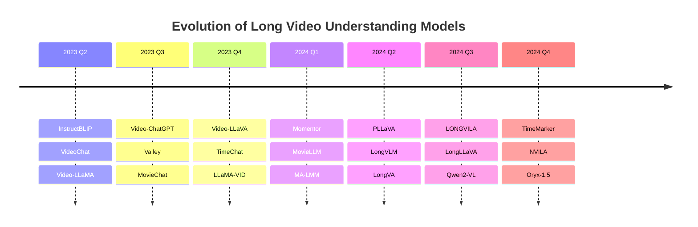

# 🎬 From Seconds to Hours: Comprehensive Long Video Understanding Survey

<div align="center">

[](https://arxiv.org/pdf/2409.18938)
[](https://github.com/Vincent-ZHQ/LV-LLMs)
[](LICENSE)
[](https://github.com/Vincent-ZHQ/LV-LLMs/stargazers)

*A comprehensive survey on MultiModal Large Language Models for Long Video Understanding*

[📖 Paper](https://arxiv.org/pdf/2409.18938) | [🌐 Project Page](https://github.com/Vincent-ZHQ/LV-LLMs) 

</div>

---

## 📋 Table of Contents

- [🎯 Overview](#-overview)
- [🔍 Abstract](#-abstract)
- [🌟 Key Contributions](#-key-contributions)
- [📊 Survey Scope](#-survey-scope)
- [🤖 Long Video Understanding Models](#-long-video-understanding-models)
- [📈 Benchmarks & Datasets](#-benchmarks--datasets)
- [📊 Performance Analysis](#-performance-analysis)
- [🔬 Technical Analysis](#-technical-analysis)
- [🚀 Future Directions](#-future-directions)
- [📚 Citation](#-citation)
- [🤝 Contributing](#-contributing)
- [📄 License](#-license)

---

## 🎯 Overview

This repository contains a comprehensive survey on **MultiModal Large Language Models (MM-LLMs)** for **Long Video Understanding**. As video content continues to grow exponentially, understanding videos that span from seconds to hours becomes increasingly crucial for various applications including video analysis, content moderation, educational technology, and entertainment.

### 🎥 Why Long Video Understanding Matters

- **Scale Challenge**: Modern videos range from short clips to multi-hour content
- **Temporal Complexity**: Long videos contain complex temporal dependencies and narrative structures
- **Real-world Applications**: Movie analysis, lecture understanding, surveillance, and documentary processing
- **Technical Innovation**: Pushing the boundaries of multimodal AI capabilities

---

## 🔍 Abstract

Long video understanding represents a significant frontier in multimodal artificial intelligence, requiring models to process and comprehend video content spanning from minutes to hours. This survey provides a comprehensive analysis of recent advances in MultiModal Large Language Models (MM-LLMs) specifically designed for long video understanding tasks.

We systematically review **50+ state-of-the-art models** developed between 2023-2024, analyzing their architectural innovations, training strategies, and performance across various benchmarks. Our analysis covers key technical challenges including:

- **Temporal Modeling**: How models capture long-range temporal dependencies
- **Memory Efficiency**: Strategies for processing extended video sequences
- **Multimodal Fusion**: Integration of visual, audio, and textual information
- **Scalability**: Approaches to handle videos of varying lengths

---

## 🌟 Key Contributions

### 📊 Comprehensive Model Analysis
- **50+ Models Reviewed**: Systematic analysis of recent MM-LLMs for long video understanding
- **Technical Taxonomy**: Classification based on architecture, training, and capabilities
- **Performance Comparison**: Standardized evaluation across multiple benchmarks

### 🔧 Technical Insights
- **Architecture Patterns**: Identification of successful design principles
- **Training Strategies**: Analysis of effective learning approaches
- **Efficiency Techniques**: Memory and computational optimization methods

### 📈 Benchmark Evaluation
- **4 Major Benchmarks**: Comprehensive evaluation framework
- **Performance Metrics**: Detailed analysis of model capabilities
- **Trend Analysis**: Evolution of model performance over time

### 🚀 Future Roadmap
- **Research Gaps**: Identification of current limitations
- **Emerging Directions**: Promising areas for future research
- **Technical Challenges**: Open problems in the field

---

## 📊 Survey Scope

### 🎯 Focus Areas

| **Aspect** | **Coverage** |
|------------|--------------|
| **Model Types** | Vision-Language Models, Video-Language Models, Multimodal LLMs |
| **Video Length** | Short (seconds), Medium (minutes), Long (hours) |
| **Tasks** | Video QA, Captioning, Summarization, Temporal Localization |
| **Architectures** | Transformer-based, Memory-augmented, Hierarchical |
| **Time Period** | 2023-2024 (Latest developments) |

### 📈 Model Evolution Timeline



---

## 🤖 Long Video Understanding Models

### 📊 Model Comparison Table

<details>
<summary><b>🔍 Click to expand the comprehensive model comparison table</b></summary>

<table>
  <thead>
    <tr>
      <th>Model</th>
      <th>Year</th>
      <th colspan="2" style="text-align:center;">Backbone</th>
      <th colspan="3" style="text-align:center;">Connector</th>
      <th>Frame</th>
      <th>Token</th>
      <th colspan="3" style="text-align:center;">Training</th>
      <th>Long</th>
    </tr>
  </thead>
  <tbody>
    <tr>
      <td>Model</td>
      <td></td>
      <td>Visual Encoder</td>
      <td>LLMs</td>
      <td>Image-level</td>
      <td>Video-level</td>
      <td>Long-video-level</td>
      <td></td>
      <td></td>
      <td>Hardware</td>
      <td>PreT</td>
      <td>IT</td>
    </tr>
    <tr>
      <td><a href="https://arxiv.org/abs/2305.06500">InstructBLIP</a></td>
      <td>23.05</td>
      <td>EVA-CLIP-ViT-G/14</td>
      <td>FlanT5, Vicuna-7B/13B</td>
      <td>Q-Former</td>
      <td>--</td>
      <td>--</td>
      <td>4</td>
      <td>32/128</td>
      <td>16 A100-40G</td>
      <td>Y-N-N</td>
      <td>Y-N-N</td>
      <td>No</td>
    </tr>
    <tr>
      <td><a href="https://arxiv.org/abs/2305.06355">VideoChat</a></td>
      <td>23.05</td>
      <td>EVA-CLIP-ViT-G/14</td>
      <td>StableVicuna-13B</td>
      <td>Q-Former</td>
      <td>Global multi-head relation aggregator</td>
      <td>--</td>
      <td>8</td>
      <td>/32</td>
      <td>1 A10</td>
      <td>Y-Y-N</td>
      <td>Y-Y-N</td>
      <td>No</td>
    </tr>
    <tr>
      <td><a href="http://openaccess.thecvf.com/content/CVPR2024/papers/Song_MovieChat_From_Dense_Token_to_Sparse_Memory_for_Long_Video_CVPR_2024_paper.pdf">MovieChat</a></td>
      <td>23.07</td>
      <td>EVA-CLIP-ViT-G/14</td>
      <td>LLama-7B</td>
      <td>Q-Former</td>
      <td>Frame merging, Q-Former</td>
      <td>Merging adjacent frames</td>
      <td>2048</td>
      <td>32/32</td>
      <td>-</td>
      <td>E2E</td>
      <td>E2E</td>
      <td>✅ Yes</td>
    </tr>
    <tr>
      <td><a href="https://openaccess.thecvf.com/content/CVPR2024/papers/Ren_TimeChat_A_Time-sensitive_Multimodal_Large_Language_Model_for_Long_Video_CVPR_2024_paper.pdf">TimeChat</a></td>
      <td>23.12</td>
      <td>EVA-CLIP-ViT-G/14</td>
      <td>LLaMA2-7B</td>
      <td>Q-Former</td>
      <td>Sliding window Q-Former</td>
      <td>Time-aware encoding</td>
      <td>96</td>
      <td>/96</td>
      <td>8 V100-32G</td>
      <td>Y-Y-N</td>
      <td>N-N-Y</td>
      <td>✅ Yes</td>
    </tr>
    <tr>
      <td><a href="https://arxiv.org/pdf/2408.10188">LONGVILA</a></td>
      <td>24.08</td>
      <td>SigLIP-SO400M</td>
      <td>Qwen2-1.5B/7B</td>
      <td colspan="3" style="text-align:center;">Multi-Modal Sequence Parallelism</td>
      <td>1024</td>
      <td>256/</td>
      <td>256 A100 80G</td>
      <td>Y-Y-N</td>
      <td>Y-Y-Y</td>
      <td>✅ Yes</td>
    </tr>
    <tr>
      <td><a href="https://arxiv.org/pdf/2412.04468">NVILA</a></td>
      <td>24.12</td>
      <td>SigLIP-SO400M</td>
      <td>Qwen2-7B/14B</td>
      <td>Spatial-to-Channel Reshaping</td>
      <td colspan="2" style="text-align:center;">Temporal Averaging</td>
      <td>256</td>
      <td>/8192</td>
      <td>128 H100-80G</td>
      <td>Y-Y-N</td>
      <td>Y-Y-Y</td>
      <td>✅ Yes</td>
    </tr>
  </tbody>
</table>

*Note: This is a condensed view. The full table contains 50+ models with detailed specifications.*

</details>

### 🏆 Notable Model Categories

#### 🎯 **Memory-Augmented Models**
- **MovieChat**: Sparse memory mechanism for long video processing
- **MA-LMM**: Memory bank compression for efficient storage
- **TimeChat**: Time-aware encoding with sliding windows

#### ⚡ **Efficiency-Focused Models**
- **LONGVILA**: Multi-modal sequence parallelism
- **LongVA**: Token expansion and compression strategies
- **Video-XL**: Dynamic compression techniques

#### 🔄 **Hierarchical Processing Models**
- **LongVLM**: Hierarchical token merging
- **SlowFast-LLaVA**: Dual-pathway processing
- **LongLLaVA**: Hybrid Mamba architecture

---

## 📈 Benchmarks & Datasets

### 🎯 Long Video Understanding Benchmarks

| **Benchmark** | **Videos** | **Annotations** | **Avg Duration** | **Focus** |
|---------------|------------|-----------------|------------------|-----------|
| **Video-MME** | 900 | 2,700 | 17.0 min | Multi-scale evaluation |
| **HourVideo** | 500 | 12,976 | 45.7 min | Hour-level understanding |
| **HLV-1K** | 1,009 | 14,847 | 55.0 min | Comprehensive evaluation |
| **LVBench** | 103 | 1,549 | 68.4 min | Long-form analysis |

### 📊 Benchmark Details

#### 🎬 **Video-MME**
- **Description**: Multi-scale video understanding benchmark
- **Strengths**: Covers short, medium, and long videos
- **Tasks**: Video QA, temporal reasoning, content understanding
- **Links**: [Project](https://video-mme.github.io/home_page.html) | [GitHub](https://github.com/BradyFU/Video-MME) | [Dataset](https://github.com/BradyFU/Video-MME?tab=readme-ov-file#-dataset) | [Paper](https://arxiv.org/pdf/2405.21075)

#### ⏰ **HourVideo**
- **Description**: Hour-level video understanding evaluation
- **Strengths**: Focus on very long video content
- **Tasks**: Long-term temporal reasoning, narrative understanding
- **Links**: [Project](https://hourvideo.stanford.edu/) | [GitHub](https://github.com/keshik6/HourVideo) | [Dataset](https://huggingface.co/datasets/HourVideo/HourVideo) | [Paper](https://arxiv.org/abs/2411.04998)

#### 🎯 **HLV-1K**
- **Description**: Comprehensive hour-level video benchmark
- **Strengths**: Large-scale annotations, diverse content
- **Tasks**: Multi-aspect video understanding
- **Links**: [Project](https://vincent-zhq.github.io/hlv-1k-project/) | [GitHub](https://github.com/Vincent-ZHQ/HLV-1K) | [Dataset](https://github.com/Vincent-ZHQ/HLV-1K) | [Paper](https://arxiv.org/submit/6108440/view)

#### 📊 **LVBench**
- **Description**: Long video understanding benchmark
- **Strengths**: High-quality annotations, challenging scenarios
- **Tasks**: Complex reasoning over extended content
- **Links**: [Project](https://lvbench.github.io/) | [GitHub](https://github.com/THUDM/LVBench) | [Dataset](https://huggingface.co/datasets/THUDM/LVBench) | [Paper](https://arxiv.org/pdf/2406.08035)

---

## 📊 Performance Analysis

### 🏆 Performance on Long Video Benchmarks

<div align="center">

</div>

### 📈 Performance on Common Video Benchmarks

<div align="center">

</div>

### 📊 Key Performance Insights

#### 🎯 **Top Performers**
- **NVILA**: Leading performance on multiple benchmarks
- **LONGVILA**: Excellent scalability for very long videos
- **TimeMarker**: Strong temporal understanding capabilities

#### 📈 **Performance Trends**
- **2024 Models**: Significant improvements over 2023 baselines
- **Scaling Effects**: Larger models generally perform better
- **Efficiency Trade-offs**: Balance between performance and computational cost

#### 🔍 **Analysis Highlights**
- Models with dedicated long-video architectures outperform general-purpose models
- Memory-augmented approaches show consistent improvements
- Multi-scale processing strategies are becoming standard

---

## 🔬 Technical Analysis

### 🏗️ **Architecture Patterns**

#### 🧠 **Memory Mechanisms**
```
📊 Memory-Augmented Models (15+ models)
├── 🎬 Sparse Memory (MovieChat, MA-LMM)
├── 🔄 Sliding Windows (TimeChat, LLaMA-VID)
└── 📈 Dynamic Compression (Video-XL, Oryx-1.5)
```

#### ⚡ **Efficiency Strategies**
```
🚀 Efficiency Techniques
├── 🔗 Token Merging (LongVLM, Video-LLaVA)
├── 📊 Hierarchical Processing (SlowFast-LLaVA)
├── 🔄 Parallel Processing (LONGVILA)
└── 📈 Adaptive Pooling (PLLaVA, VideoGPT+)
```

#### 🎯 **Connector Innovations**
```
🔧 Connector Types
├── 🤖 Q-Former Based (MovieChat, TimeChat)
├── 🔗 Cross-Attention (Qwen-VL, EVLM)
├── 📊 MLP Projectors (VITA, LLaVA-OneVision)
└── 🧠 Advanced Fusion (Kangaroo, NVILA)
```

### 📊 **Training Strategies**

| **Strategy** | **Models** | **Advantages** | **Challenges** |
|--------------|------------|----------------|----------------|
| **End-to-End** | MovieChat, MA-LMM | Optimal performance | High computational cost |
| **Stage-wise** | Video-LLaVA, TimeChat | Stable training | Suboptimal alignment |
| **Hybrid** | LongVA, LONGVILA | Balanced approach | Complex implementation |

### 🎯 **Key Technical Innovations**

#### 🔄 **Temporal Modeling**
- **Sliding Window Attention**: Efficient processing of long sequences
- **Hierarchical Temporal Fusion**: Multi-scale temporal understanding
- **Memory-Augmented Architectures**: Long-term dependency modeling

#### ⚡ **Efficiency Optimization**
- **Token Compression**: Reducing computational overhead
- **Parallel Processing**: Leveraging multiple GPUs effectively
- **Dynamic Allocation**: Adaptive resource management

#### 🎯 **Multimodal Fusion**
- **Cross-Modal Attention**: Better alignment between modalities
- **Temporal-Spatial Integration**: Comprehensive scene understanding
- **Context-Aware Processing**: Adaptive to content complexity

---

## 🚀 Future Directions

### 🔬 **Research Opportunities**

#### 🎯 **Technical Challenges**
- **Ultra-Long Videos**: Processing videos longer than current capabilities
- **Real-Time Processing**: Enabling live video understanding
- **Multi-Language Support**: Expanding beyond English-centric models
- **Few-Shot Learning**: Adapting to new domains with limited data

#### 🌟 **Emerging Trends**
- **Multimodal Reasoning**: Enhanced logical reasoning capabilities
- **Interactive Understanding**: User-guided video analysis
- **Causal Understanding**: Modeling cause-and-effect relationships
- **Emotional Intelligence**: Understanding emotional content in videos

#### 🔧 **Technical Innovations**
- **Neural Architecture Search**: Automated model design
- **Federated Learning**: Privacy-preserving video understanding
- **Edge Computing**: Mobile and embedded deployment
- **Quantum Computing**: Leveraging quantum advantages

### 📈 **Industry Applications**

#### 🎬 **Entertainment**
- **Content Creation**: AI-assisted video editing and production
- **Recommendation Systems**: Personalized content discovery
- **Quality Assessment**: Automated content evaluation

#### 🏫 **Education**
- **Lecture Analysis**: Automated educational content processing
- **Student Engagement**: Understanding learning patterns
- **Accessibility**: Enhanced content accessibility features

#### 🏥 **Healthcare**
- **Medical Imaging**: Long-term patient monitoring
- **Surgical Analysis**: Procedure understanding and training
- **Therapy Assessment**: Behavioral analysis and intervention

---

## 📚 Citation

If you find our survey useful in your research, please consider citing:

```bibtex
@article{zou2024seconds,
  title={From Seconds to Hours: Reviewing MultiModal Large Language Models on Comprehensive Long Video Understanding},
  author={Zou, Heqing and Luo, Tianze and Xie, Guiyang and Lv, Fengmao and Wang, Guangcong and Chen, Juanyang and Wang, Zhuochen and Zhang, Hansheng and Zhang, Huaijian and others},
  journal={arXiv preprint arXiv:2409.18938},
  year={2024}
}
```

---

## 🤝 Contributing

We welcome contributions to this survey! Here's how you can help:

### 📝 **How to Contribute**
1. **Fork** the repository
2. **Create** a feature branch (`git checkout -b feature/new-model`)
3. **Add** your model/benchmark information
4. **Commit** your changes (`git commit -am 'Add new model: ModelName'`)
5. **Push** to the branch (`git push origin feature/new-model`)
6. **Create** a Pull Request

### 🎯 **Contribution Guidelines**
- **Model Additions**: Include complete technical specifications
- **Benchmark Updates**: Provide official performance numbers
- **Documentation**: Maintain consistent formatting
- **References**: Include proper citations and links

### 📊 **What We're Looking For**
- New long video understanding models
- Updated benchmark results
- Technical analysis and insights
- Bug fixes and improvements

---

## 📄 License

This project is licensed under the MIT License - see the [LICENSE](LICENSE) file for details.

---

## 🙏 Acknowledgments

We thank all the researchers and developers who have contributed to the field of long video understanding. Special thanks to:

- **Model Developers**: For creating innovative architectures and sharing their work
- **Benchmark Creators**: For providing standardized evaluation frameworks
- **Open Source Community**: For making research accessible and reproducible
- **Reviewers and Contributors**: For helping improve this survey

---

<div align="center">

### 🌟 Star History

[](https://star-history.com/#bytedance/LVU_Survey&Date)

**Made with ❤️ by the Long Video Understanding Research Community**

[⬆️ Back to Top](#-from-seconds-to-hours-comprehensive-long-video-understanding-survey)

</div>
